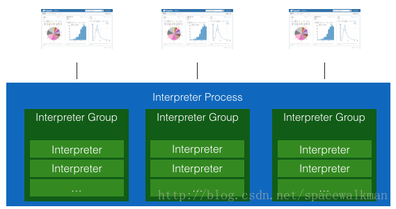

>
>  主要为在 Zeppelin 0.7.3 中自定义 Interpreter插件 的开发过程
>

#	1 前言
​	本文是在   `Zeppelin` 中自定义  `Interpreter`  插件的说明手册。包括  `Zeppelin`  相关内容的简介，自定义 `Interpreter` 的开发过程，及自定义 `Interpreter` 示例的使用。


# 2 系统需求

​	以下说明 Zeppelin 0.7.3 自定义 Interpreter 插件的基本需求。

## 2.1 系统硬件

​	Intel x86_64 服务器。

## 2.2 系统软件
​	Zeppelin 自定义 Interpreter 插件可在 Windows 或Linux 下开发。测试过程中使用 Windows 环境为Win10 企业版；Linux使用虚拟机环境： Ubuntu 16.04 LTS Server x86。

​	准备工作：① Apache Zeppelin正式支持并在以下环境下进行测试： Oracle JDK **1.7**  (设置  `JAVA_HOME`) 

​			   ② Maven3.x+ 


# 3 Zeppelin

## 3.1 Zeppelin简介

​	**简介：** Zeppelin是一个基于Web的软件，用于交互式数据分析。它一开始是Apache 基金会的孵化项目，2016年5月正式成为顶级项目。采用`Java（主要）+Scala+R+PythonR+Bash+JS`混合开发，采用`maven`作为build工具。

​	**本质：**是一个web应用程序，它以独立的`jvm`进程的方式来启动Interpreter（解释器），在服务器端执行各种语言的代码片段，并将结果以Text、html、Table等形式返回给前端Zeppelin UI。 

​	**技术stack：**前台：`AngularJS、Node.js、WebSocket、Grunt、Bower、Highlight.js、BootStrap`；	后台：`Jetty（embedding）、Thrift、Shiro(权限）、Jersey REST API`		

> Websocket:html5的一个协议规范 ,本质上是一个基于tcp的协议，是先通过HTTP/HTTPS协议发起一条特殊的http请求进行握手后创建一个用于交换数据的TCP连接，此后服务端与客户端通过此TCP连接进行实时通信 .
>
> Grunt:是基于 Node.js 的项目构建工具。它可以自动运行你所设定的任务。Grunt 拥有数量庞大的插件,几乎任何你所要做的事情都可以用 Grunt 实现。 
>
> Bower:是一个包管理工具。包的内容没有限制，比如：js库，框架，图片/字体资源等等或者它们的组合都可以。highlight.js是一款轻量级的Web代码语法高亮库。 
>
> Thrift:是一个跨语言的服务部署框架。Thrift通过IDL（Interface Definition Language，接口定义语言）来定义RPC（Remote Procedure Call，远程过程调用）的接口和数据类型，然后通过thrift编译器生成不同语言的代码，并由生成的代码负责RPC协议层和传输层的实现。 
>
> Shiro:是一个强大且易用的Java安全框架,执行身份验证、授权、密码学和会话管理。 

​	**用途功能**：①Zeppelin 描述自己是一个可以进行*数据摄取、数据发现、数据分析、数据可视化与协作*的`Notebook`，帮助开发者、数据科学家等有效地处理数据，而不必使用复杂的命令行，也不必关心集群的实现细节。 ②Zeppelin的数据可视化：其中已经包含了一些基本图表。任何后端语言的输出可轻松通过*表格、折线图、柱状图、饼图*等形式展示总和，*数量值，平均值，最小值，最大值*的相关数值 。③Zeppelin支持*动态表单*；协作：支持将我们写的Note的*URL在协作者间共享*；发布：支持将*仅显示结果的URL 作为iframe嵌入到网站中*等功能。

​	**整体架构：**官网Zeppelin架构图：


​	和其他类似的系统（HUE）一样，Zeppelin具有客户端/服务器架构，客户端Client一般就是指浏览器。服务器Server接收客户端的请求后，会起一个ZeppelinServer主进程。接着根据具体请求通过两种连接方式来连接解析器，一种是通过在ZeppelinServer主进程中加载Classloader连接解析器，另一种是将请求通过Thrift协议发送给远程解析器组RemoteInterpreter进行连接【注意：Zeppelin使用Thrift定义了其主进程ZeppelinServer与需要采用独立JVM进程运行的各解释器之间的通信协议 】，解析器组物理表现为JVM进程，负责实际处理客户端的请求并与服务器进行通信。	

​	**Zeppelin 总体模型**

​                           

​	总体来说，Zeppelin可以分为Web，Notebook以及Interpreter三个大部分。

<u>Web</u>

- Web UI：即用户可见的网页，提供Note编辑以及图表显示功能，并且与后端的Notebook Server保持Websocket连接。

- REST API：主要是 Notebook 以及 Interpreter 相关的REST API。

<u>Notebook</u>

- Notebook Server：用于建立并维护前端网页与后端服务器之间的Websocket连接；它其实是一个job listener，接收并处理前端网页发来的Note执行请求，在后端生成并执行相应的job，并将job执行的状态信息广播到所有的前端页面。

- Notebook，Note，Paragraph，Job：
  - Notebook：是多个Note 的集合.认为整个运行实例是一个Notebook，其中可以用很多篇Note。
  - Note：单个’记事本’的内存对象，每一篇Note就是一个具体的页面，它是zeppelin管理的最小单位，无论是做权限控制、共享、还是持久化，都是以Note为粒度的，这些Note默认存储在`$ZEPPELIN_HOME/notebook`文件夹中。
  - Paragraph：每一个Note 中包含多个Paragraph，每一个Paragraph就是一个代码段落，每个Paragraph 由code段和result 段构成。Paragraph是一个可执行单元，它等同于一个Job。
  - Job：Job是Zeppelin后端调度和执行的单位，会在具体的Interpreter上运行。

<u>Interpreter</u>

​	InterpreterFactory主要有以下职能：

- 维护所有Interpreter的配置信息并存储在`$ZEPPELIN_HOME/conf/interpreter.json`文件中。

- 管理所有的Interpreter：

  - InterpreterGroup：一个InterpreterGroup中包含多个Interpreter，同组内的Interperter共享相同的配置信息，例如Spark和SparkSQL interpreter在一个InterpreterGroup内。
  - InterpreterSetting：一个InterpreterGroup会有一个InterpreterSetting，其中包含着相应的配置信息。
  - 所有的InterpreterSetting都被持久化在`$ZEPPELIN_HOME/conf/interpreter.json`文件里。

- 维护Note与InterpreterGroup直接的绑定关系，即每篇Note可以绑定不同的InterpreterGroup.

  Interpreter主要有以下职能：

- 每一个Interpreter都有一个对应的Scheduler实例，Scheduler将Job的提交与执行变成了一个异步的过程，即Job在Scheduler处进入队列等待提交，用户可以定期收到Job执行相关的信息。Zeppelin内部有三种Scheduler：

  - FIFOScheduler: 适用于Paragraph只能顺序执行的Interpreter，如SparkInterpreter, ShellInterpreter等。
  - ParallelScheduler: 适用于Paragraph可并行执行的Interpreter，如SparkSqlInterpreter, MarkdownInterpreter等。
  - RemoteScheduler: 仅适用于RemoteInterpreter。

- Local Interpreter和Remote Interpreter:

  - Local Interpreter：即ClassloaderInterpreter，运行在Zeppelin Server主进程中。
  - Remote Interpreter：运行在一个单独的进程里，通过Thrift接口与Zeppelin Server主进程通信，其本质就是用一个新的进程来运行一个Local Interpreter（即ClassloaderInterpreter）。

  


## 3.2 优点和缺点

### 3.2.1 优点【功能点】

1. 支持用户自己选择repl交互式解释器进程的共享方式：有Per-User、Per-Note两种模式的。
   - per-user模式：同一个用户不同note之间的相同语言的代码都可以发送到同一个解释器，节省服务器资源。由于解释器同时保留多个代码段执行的上下文，这种模式可以实现跨note交换数据。但是，由于多个note共用一个repl解释器，解释器比较繁忙，用户的响应时间变长。

   - per-note模式，按Note 将请求发送给解析器，比较耗费服务器资源，但是代码执行速度块，用户体验好.
2. 支持用户自定义并发执行的设置。当然要视Note中paragraph的代码是否具有上下文相关性来决定是否可以并发执行，当无上下文相关性时，可显式设置可以并发。
3. 方便扩展的解释器接口设计：zeppelint提供多种语言的repl解释器，提供定义良好接口，支持二次开发。
4. 配置化能力 :将编译时常量变为运行时常量，抽取出来，配置文件化，可以显著提高的系统的可移植性 .
5. 前端实时反馈能力 :实时地反馈执行结果，显示进度和日志，允许用户中止正在执行的任务 
6. 持久化能力 :系统所有的配置项目，所有的note代码和执行结果、权限等，系统重启之后需要恢复，持久化 

### 3.2.2 缺点

1. 总体来说用户体验十分不错，但支持的图表太少了，只支持大众化的折线，柱状图等，并没有混合的图表。 
2. 没有对元数据的管理的相关操作 。
3. 目前为单机部署：interperter Process已经成为制约zeppelin横向扩展的瓶颈问题。如果在多个节点上动态分布interpreter进程，并且保持zeppelin与这些进程之间的通信，那将会更好。

### 3.2.3 展望

1. 完善Zeppelin Visualization功能,将会以更多自定义形式展示（实验中）
2. 完善Zeppelin Application 功能，（实验中）
3. 打包方式的重设计：①仅打包核心interpreters②从repository 拉取第三方相关interpreters

## 3.3 Zeppelin 与HUE 的对比

| 区别     | Zeppelin                                                     | HUE                                                          |
| -------- | ------------------------------------------------------------ | ------------------------------------------------------------ |
| 实现     | 提供了web版的类似ipython的notebook，用于做数据分析和可视化。 | 开源的Apache Hadoop UI系统，最早是由Cloudera Desktop演化而来，由Cloudera贡献给开源社区，它是基于Python Web框架Django实现的。通过使用Hue我们可以在浏览器端的Web控制台上与Hadoop集群进行交互来分析处理数据 |
| 功能范畴 | Zeppelin只提供了单一的数据处理功能，包括前面提到的数据摄取、数据发现、数据分析、数据可视化等都属于数据处理的范畴 。Zeppelin只是一个数据处理工具 | 功能相对丰富的多，除了类似的数据处理，还有元数据管理、Oozie工作流管理、作业管理、用户管理、Sqoop集成等很多管理功能 。 Hue更像是一个综合管理工具。 |
| 试用场景 | Zeppelin适合单一数据处理、但后端处理语言繁多的场景，尤其适合Spark。 | Hue适合与Hadoop集群的多个组件交互、如Oozie工作流、Sqoop等联合处理数据的场景，尤其适合与Impala协同工作。 |

# 4 Zeppelin Interpreter

## 4.1 Interpreter介绍	

​	Zeppelin中最核心的概念是`     Interpreter` 解析器，解析器是一个插件式的体系结构，允许任何语言或后端数据处理程序以插件的形式添加到Zeppelin中。目前Apache Zeppelin已经支持许多解释器,我们可以在{ZEPPELIN_HOME}/interpreter/下找到这些解析器的文件夹。如图： 

​                                                              

​	interpreter的每个文件夹中存放的是编译好的jar包,以及该interpreter的相关依赖。	

​	以下是`Interpreter`的架构图：


​	

**1. Apache Zeppelin 启动时初始化interpreter 的过程**：在 `zeppelin` 启动时，启动 `ZeppelinServer` 进程，当用户选择使用某一个 `interpreter` 的时候会通过 `lazy` 的方式启动一个进程负责该 `interperter` 的请求.InterpreterFactory 负责管理interpreter的生命周期，当我们start server 时，第一步是读取`${ZEPPELIN_HOME}/interpreter` 下的子目录，这些子目录中包含第三方框架相关的jar包，InterpreterFactory  将这些可用的interpreter列表以默认配置来加载。第二步,InterpreterFactory读取`$ {ZEPPELIN_HOME}/conf/interpreter.json`,其中存储了interpreter的实际配置，以及Note和interpreter之间的映射，这些信息与Zeppelin web UI的Interpreter选项栏中的信息相同。 

**2. Interpreter与Interpreter group：**`zeppelin` 对于每一类支持的计算引擎都可以创建多个配置，每一个插件的配置称为一个 `Interpreter`，相同类型的 `Interpreter` 被归为一个 `Interpreter group`，一个 `group` 内的所有 `Interpreter` 共享一个 `JVM` 进程，`InterpreterGroup`是创建jvm、note bind的最小单位 。每一个`Interpreter`都属于同一个`InterpreterGroup`，同一个`InterpreterGroup`中的`Interpreter`之间可以相互引用，例如`Spark InterpreterGroup`中的`SparkSqlInterpreter `可以引用 `SparkInterpreter `以获取 `SparkContext`，因为他们属于同一个`InterpreterGroup`。

**3. shared | scoped | isolated三种模式:** 在多个note时，为每个note创建不同的interpreter进程还是共享同一个interpreter进程，zeppelin UI上提供了三种模式可供选择：shared,scoped,isolated。	

​	在`shared`模式下:一种解释器只有一个Interpreter进程，并且该进程中只有一个InterpreterGroup，所有的Interpreter实例都从属于该InterpreterGroup，当然，也肯定在同一个进程内部。多个note之间，可以很容易的共享变量。

​                                                                  

​	在`scoped `模式下: 一种repl解释器只有一个Interpreter进程，但是与Shared模式不同，会创建多个InterpreterGroup，每个note关联一个InterpreterGroup。这样每个note相当于有了自己的session，session与session相互隔离，但是仍然由于这些InterpreterGroup仍然在同一个进程中，它们之间仍然可以共享变量。 

​                        

​	在`Isolated`模式下: 独占式，为每个note创建一个独立的intepreter进程，该进程中创建一个InterpreterGroup实例，为该note的服务的Interpreter实例从属于该InterpreterGroup。 

​                             

**4. Interpreter的形式：**Zeppelin 可以接入不同的处理引擎供用户使用，当我们每接入一个处理引擎则需要为其配置一个 interpreter,注意：zeppelin 的 interpreter 不仅包含数据处理的引擎（`spark/hive/impala/flink/kylin/file/hbase`），也包括编程语言和语法格式(`python/markdown/shell`)。


##	4.2 自定义 Interpreter 插件开发

​	由于 Zeppelin 目前支持的解析器还不够完善，所以自定义 Interpreter 并关联到我们需要使用的数据处理引擎或编程语言（例如，MongoDB，Mysql，ECharts等） 非常有必要。
###	4.2.1 下载 Zeppelin 源码

​	从`Zeppelin`官方可以下载到目前` Zeppelin`的最新版本代码`all`：[**http://mirrors.hust.edu.cn/apache/zeppelin/zeppelin-0.7.3/zeppelin-0.7.3-bin-all.tgz**    [此链接包含Zeppelin目前所有内置 Interpreter , 可适用于 Windows 和Linux]

**Attention**:`net-install`的编译包，解压后自行安装各解析器。

Attention:Zeppelin 版本0.6升级到0.7应注意https://zeppelin.apache.org/docs/0.7.3/install/upgrade.html#upgrading-from-zeppelin-06-to-07

### 4.2.2 自定义解析器 NewInterpreter

<u>Step1:</u> Maven 构建工程时 选择与当前所使用的zeppelin同版本的依赖包zeppelin-interpreter 

```java
<dependency>
    <groupId>org.apache.zeppelin</groupId>
    <artifactId>zeppelin-interpreter</artifactId>
    <version>0.7.3</version>
    <scope>provided</scope>
</dependency>
```

​	由于Zeppelin运行环境已经有了该依赖包，所以我们再创建自定义Interpreter插件的时候只需要在代码中对其依赖，打包过程中不需要打包该依赖。所以使用provided依赖方式.

**Attention1:** 添加内部开发的Interpreter 的相关依赖包. eg: 连接Hive则需要添加 hive-metadata\hive-cli 等相关依赖。


<u>Step2:</u> 创建实现类 并继承 org.apache.zeppelin.interpreter.Interpreter 并实现相应的抽象方法

​	Interpreter是一个抽象类，该类是Zeppelin核心类，Zeppelin提供的核心价值：解释执行各种语言的代码，都是通过该抽象类的每个具体的实现类完成的。Interpreter主要规定了各语言解释器需要遵循的“规范” .

```java
public class NewInterpreter extends Interpreter {
    private Map<String, Thread> taskMap = new ConcurrentHashMap<String, Thread>(); //处理开启、关闭、取消任务
 
    //构造器
    public NewInterpreter(Properties property) {
        super(property);
    }

    //repl解释器的生命周期管理:打开解析器，设置程序的初始化信息
    @Override
    public void open() {
		if (new File(getProperty("***")).exists())
            logger.info("Successfully find ** location");
        else
            logger.error("testOpen: Cannot find ** location");
    }

    //repl解释器的生命周期管理:关闭解析器，释放相关资源
    @Override
    public void close() {
        for (Thread task : taskMap.values()) {
            task.interrupt();
        }
        taskMap.clear();
    }

    /**
     * 解释执行代码的接口.最主要的程序执行方法，负责前后台交互。
     * 核心思想：解析命令=>实例化NewIntepreter操作客户端=>操作NewIntepreter客户端进行数据查询
     * => 获取返回结果 封装成InterpreterResult对象
     *
     * @param s       Zeppelin 前台交互式界面的用户输入,  注意不包含第一行的  %NewInterpreter  ---->新的解析器的名称
     * @param context 用于存储Paragraph相关的信息。当前Interpreter 插件的上下文，包含插件的配置信息（包括noteId,replName,paragraphId,paragraphText等）
     * @return        InterpreterResult用于存储Job的状态信息以及执行结果，具体包括：
		           - 状态码：SUCCESS，INCOMPLETE，ERROR，KEEP_PREVIOUS_RESULT
		           - 类型：Text（Default),HTML,ANGULAR,TABLE,IMG,SVG,NULL等
     */
    @Override
    public InterpreterResult interpret(String s, InterpreterContext context) {        
        final StringBuffer result = new StringBuffer();
        final List<Throwable> exceptionList = new CopyOnWriteArrayList<Throwable>();
        
        logger.info("RUN NewInterpreter script: {}", s);
        final String strim = s.trim();
        int firstIndex = strim.indexOf('"');
        int lastIndex = strim.indexOf('"');
        final String a = st.substring(firstIndex+1,lastIndex)
       
         try {
            if (!StringUtils.isEmpty(strim)) {
                Thread taskThread = new Thread(new Runnable() {
                    @Override
                    public void run() {                        
                        try {
                            if (!Thread.interrupted()) {
                                logger.info("checking input: " + entry);
                                result.append(e)；
                            }
                        } catch (Throwable e) {
                            exceptionList.add(e);
                            logger.error(e.getMessage(), e);
                            break;
                        }
                    }
                });
                taskThread.start();
                taskThread.join();
            } else {
                return new InterpreterResult(InterpreterResult.Code.SUCCESS,
                        "Please input!");
            }
        } catch (Exception e) {
            new InterpreterException(e);
        } finally {
            taskMap.remove(context.getParagraphId());
        }
        if (exceptionList.size() > 0) {
            return new InterpreterResult(InterpreterResult.Code.ERROR,
                    ExceptionUtils.getStackTrace(exceptionList.get(0)));
        }
        return new InterpreterResult(InterpreterResult.Code.SUCCESS, result);
        
    }

    //执行代码过程中交互控制和易用性增强:调用cancel 方法中止 interpret 方法
    @Override
    public void cancel(InterpreterContext context) {
        Thread taskThread = taskMap.remove(context.getParagraphId());
        if (taskThread != null && taskThread.isAlive()) {
            taskThread.interrupt();
        }
    }

    /**
     * 返回形式
     *
     * @return FormType.SIMPLE enables simple pattern replacement (eg. Hello ${name=world}),
     * FormType.NATIVE handles form in API
     * FormType.NONE
     */
    @Override
    public FormType getFormType() {
        return FormType.SIMPLE;
    }

    // 获取执行进度的百分比，0-100
    @Override
    public int getProgress(InterpreterContext context) {
        return 0;
    }
}
```

​	 推荐：自定义的Interpreter 必须实现 open()、close()、interpret()； 最好实现 cancel()、getProgress()、completion()； 高级实现 getFormType()、getScheduler()。


Step3: 创建 interpreter-setting.json 并配置相应信息

​	将interpreter-setting.json 文件推荐放置在/src/main/resources/interpreter-setting.json中

文件示例如下：

```json
[
  {
    "group": "your-group",  //InterpreterGroup 的名称   eg:"spark"
    "name": "your-name",   //该InterpreterGroup下Interpreter 1 的名称    eg:"spark"
    "className": "your.own.interpreter.class",    //该Interpreter1 的全类名    eg:org.apache.zeppelin.spark.SparkInterpreter
    "defaultInterpreter":true,  //可选择的,Interpreter1 是否为默认该 InterpreterGroup 默认解析器
    "properties": {  //Interpreter1 的相关属性配置
      "properties1": {   // Interpreter1 的属性1 的名称  eg:"zeppelin.spark.useHiveContext"
        "envName": null,   //属性1 加载的环境变量的名称 一般都取自conf/zeppelin-env.sh eg:"ZEPPELIN_SPARK_USEHIVECONTEXT"
        "propertyName": "property.1.name",  //属性1 的名称，一般和"properties1"相同   eg:"zeppelin.spark.useHiveContext"
        "defaultValue": "propertyDefaultValue", //属性1 的缺省值， eg: "true"
        "description": "Property description"  //属性1 的描述， eg:"Use HiveContext instead of SQLContext if it is true."
      },
      "properties2": {   // Interpreter1 的属性2 的名称  eg:"master"
        "envName": "PROPERTIES_2",    // 属性2 加载的环境变量的名称  eg:"MASTER"
        "propertyName": null,    //属性2 的名称   eg:"spark.master"
        "defaultValue": "property2DefaultValue",    //属性2 的缺省值   eg:"local[*]"
        "description": "Property 2 description"   //属性2 的描述    eg:"Spark master uri. ex) spark://masterhost:7077"
      },
      ...
    }
    "editor": {   // paragraph 区域使用语法高亮的相关设置
      "language": "scala",    // 默认使用scala ,并设置语法高亮
      "editOnDblClick": false   //如果您的解释器使用标记语言(如markdown或HTML)，则将editOnDblClick设置为true，以便在pargraph上打开文本编辑器，双击并关闭段落运行。否则设置为false。
    }
  },
  {
    "group": "your-group",  //InterpreterGroup 的名称   eg:"spark"
    "name": "your-name",   //该InterpreterGroup下Interpreter 2 的名称  eg:"pyspark"
    "className": "your.own.interpreter.class",    //该Interpreter2 的全类名     eg:"org.apache.zeppelin.spark.PySparkInterpreter"
    "defaultInterpreter":true,  //Interpreter2 是否为默认该 InterpreterGroup 默认解析器
    "properties": {  //Interpreter2 的相关属性配置
      "properties1": {   // Interpreter2 的属性1 的名称  eg:"zeppelin.spark.useHiveContext"
        "envName": null,   //属性1 加载的环境变量的名称   eg:"PYSPARK_PYTHON"
        "propertyName": "property.1.name",  //属性1 的名称，一般和"properties1"相同   eg:null
        "defaultValue": "propertyDefaultValue", //属性1 的缺省值， eg: "python"
        "description": "Property description"  //属性1 的描述， eg:"Python command to run pyspark with"
      },
      ...
    }
    "editor": {   // paragraph 区域使用语法高亮的相关设置
      "language": "python",    // 默认使用scala ,并设置语法高亮
      "editOnDblClick": false
    }
  },
  ...
]
```

​	我们自己设置的该Interpreter 的相关配置在Zeppelin web UI创建后，会在{ZEPPELIN_HOME}/conf/interpreter.json 中显示。


Step4: Maven打包

```bash
>mvn clean package
>mvn clean package assembly:single   //肥包
```

### 4.2.3 插件部署

<u>Step1</u>: 拷贝NewInterpreter 插件包

​	在 {ZEPPELIN_HOME}/interpreter/下创建 NewInterpreter 文件夹，并将 4.2.2  Step4 中打好的所有依赖包拷贝至此文件夹下。


<u>Step2</u>: 实现类的配置 

​	拷贝{ZEPPELIN_HOME}/conf/zeppelin-site.xml.template为zeppelin-site.xml。修改{ZEPPELIN_HOME}/conf/zeppelin-site.xml，主要添加 注册解析器的相关类

```xml
<property>
  <name>zeppelin.interpreters</name>  				    		   
  <value>...,com.lg.NewInterpreter </value> 
  <description>Comma separated interpreter configurations. First interpreter become a default</description>
</property>
```

**Attention**:Zeppelin中有两个位置可以配置Apache Zeppelin。

- **环境变量**可以被定义`conf/zeppelin-env.sh`（`conf\zeppelin-env.cmd`适用于Windows）。设置诸如：SPARK_HOME、HADOOP_CONF_DIR等zeppelin与外围环境集成的环境变量 
- **Java属性**可以定义在`conf/zeppelin-site.xml`。(在Zeppelin 的Web UI界面上用户名—> Configuration中配置)

如果两者都被定义，则**环境变量**将被优先考虑。 


<u>Step3</u>：启动Zeppelin

​	Windows 下启动命令为： 

```bash
{ZEPPELIN_HOME}\bin\zeppelin.cmd
```

​	Linux 下启动命令为：

```bash
{ZEPPELIN_HOME}/bin/zeppelin-daemon.sh start
```

​	Linux相应的关闭命令为：

```bash
{ZEPPELIN_HOME}/bin/zeppelin-daemon.sh stop
```

<u>Step4:</u> Zeppelin 的默认web UI 的url 为 http://localhost:8080 [若需要修改端口号，可在`$ZEPPELIN_HOME/conf/zeppelin-site.xml`中修改]。 Zeppelin 管理界面添加 NewInterpreter 解析器的相关配置

​	用户anonymous—>Interpreter

 

​	添加 自定义的 Interpreter—>Create—>此时在Interpreter group 选项中会出现我们自定义的 NewInterpreter—>填写相关properties—>Save。

 


**Attention1**: 在此菜单中，您可以：①配置现有的**Interpreter实例，**②添加/删除**Interpreter实例**

**Attention2**: 新的Interpreter的名字可以在Interpreter Name处自定义，可直接使用。

**Attention3**: 当属性名称由大写字符，数字和下划线组成（[A-Z_0-9]）时，属性将导出为环境变量。否则将属性设置为JVM属性。 

**Attention4**: 解释器的依赖管理：通过在上图的 `Dependencies`中添加：

- 从Maven存储库递归加载库 eg:在上述界面中点击Repository,添加来自中央maven仓库或本地〜/.m2仓库的依赖关系；
- 从本地文件系统加载库 eg:该依赖在本地文件系统的路径；
- 添加额外的maven仓库 eg:groupId：artifactId：version  

**Attention5**: 这里的Properties 中的参数与 4.2.2 中 Step3 中配置 相通，具体可根据我们要添加的解析器来进行配置，eg: Mongo 可能需要配置mongo.server.host、mongo.server.port、mongo.server.database、mongo.server.username、mongo.server.password等。

### 4.2.4 运行

​	新建一个Note,绑定 NewInterpreter 解析器。蓝色表示对当前Note 绑定此解析器，白色未绑定。

 

​	执行命令,即可看到返回结果

 

**Attention**:Zeppelin 打印解释器响应的方式有：`Text`、`Html`、`Table`。默认情况下，Apache Zeppelin使用`Text`显示系统打印解释器响应作为纯文本。 具体配置见 https://zeppelin.apache.org/docs/0.7.3/displaysystem/basicdisplaysystem.html。同时Angular Js 的前端、后端嵌入，具体配置见 https://zeppelin.apache.org/docs/0.7.3/displaysystem/back-end-angular.html。