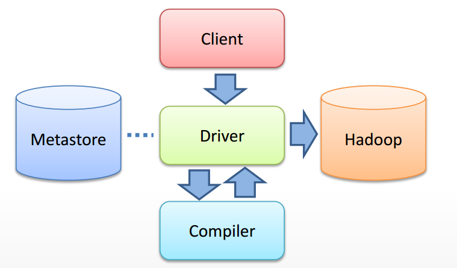
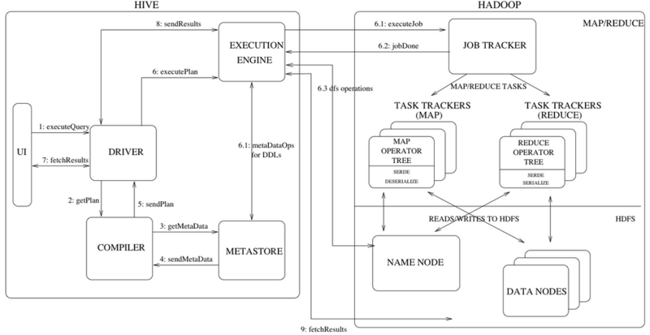

>
>  本文为实现 基本查询Hive的语句HiveQL的Zeppelin 插件
>

#	1 前言
​	本文是在Zeppelin 中实现Hive基本查询功能的说明手册。包括`Hive`的简介， 基本框架、执行入口，及HiveQL功能的Zeppelin插件定义。


# 2 Hive

## 2.1 Hive 简介

​	Hive 是建立在 Hadoop 上的数据仓库基础构架。它提供了一系列的工具，可以用来进行数据抽取，转化，加载（ETL），这是一种可以存储、查询和分析存储在 Hadoop 中的大规模数据的机制。Hive 定义了简单的类 SQL 查询语言，称为Hive QL，它允许熟悉 SQL 的用户查询数据。同时，这个语言也允许熟悉 MapReduce 开发者的开发自定义的 mapper 和 reducer 来处理内建的 mapper 和 reducer 无法完成的复杂的分析工作。 

​	以下是截取的Hive框架的解析图。





​	从框架图中可以看见从用户提交一个查询（假设通过CLI入口）直到获取最终结果，Hive内部的执行流程主要包括：

1. CLI 获取用户查询，解析用户输入的命令，提交给Driver；
2. Driver 结合编译器（COMPILER）和元数据库（METASTORE），对用户查询进行编译解析；
3. 根据解析结果（查询计划）生成MR任务提交给Hadoop执行；
4. 获取最终结果；

## 2.2 Hive 元数据

1、存储Hive版本的元数据表(VERSION)

该表比较简单，但很重要。

| VER_ID | SCHEMA_VERSION | VERSION_COMMENT   |
| ------ | -------------- | ----------------- |
| ID主键 | Hive版本       | 版本说明          |
| 1      | 1.1.0          | Set  by MetaStore |

如果该表出现问题，根本进入不了Hive-Cli。比如该表不存在，当启动Hive-Cli时候，就会报错”Table ‘hive.version’ doesn’t exist”。

2、Hive数据库相关的元数据表(DBS、DATABASE_PARAMS)

DBS：该表存储Hive中所有数据库的基本信息，字段如下:

| 表字段          | 说明               | 示例数据                                |
| --------------- | ------------------ | --------------------------------------- |
| DB_ID           | 数据库ID           | 1                                       |
| DESC            | 数据库描述         | Default  Hive database                  |
| DB_LOCATION_URI | 数据HDFS路径       | hdfs://193.168.1.75:9000/test-warehouse |
| NAME            | 数据库名           | default                                 |
| OWNER_NAME      | 数据库所有者用户名 | public                                  |
| OWNER_TYPE      | 所有者角色         | ROLE                                    |

 DATABASE_PARAMS：该表存储数据库的相关参数，在CREATE DATABASE时候用WITH DBPROPERTIES(property_name=property_value, …)指定的参数。

| 表字段      | 说明     | 示例数据  |
| ----------- | -------- | --------- |
| DB_ID       | 数据库ID | 1         |
| PARAM_KEY   | 参数名   | createdby |
| PARAM_VALUE | 参数值   | root      |

DBS和DATABASE_PARAMS这两张表通过DB_ID字段关联。

3、Hive表和视图相关的元数据表

主要有TBLS、TABLE_PARAMS、TBL_PRIVS，这三张表通过TBL_ID关联。

TBLS:该表中存储Hive表，视图，索引表的基本信息

| 表字段             | 说明              | 示例数据                   |
| ------------------ | ----------------- | -------------------------- |
| TBL_ID             | 表ID              | 21                         |
| CREATE_TIME        | 创建时间          | 1447675704                 |
| DB_ID              | 数据库ID          | 1                          |
| LAST_ACCESS_TIME   | 上次访问时间      | 1447675704                 |
| OWNER              | 所有者            | root                       |
| RETENTION          | 保留字段          | 0                          |
| SD_ID              | 序列化配置信息    | 41，对应SDS表中的SD_ID     |
| TBL_NAME           | 表名              | ex_detail_ufdr_30streaming |
| TBL_TYPE           | 表类型            | EXTERNAL_TABLE             |
| VIEW_EXPANDED_TEXT | 视图的详细HQL语句 |                            |
| VIEW_ORIGINAL_TEXT | 视图的原始HQL语句 |                            |

 TABLE_PARAMS:该表存储表/视图的属性信息

| 表字段      | 说明   | 示例数据                     |
| ----------- | ------ | ---------------------------- |
| TBL_ID      | 表ID   | 1                            |
| PARAM_KEY   | 属性名 | totalSize，numRows，EXTERNAL |
| PARAM_VALUE | 属性值 | 970107336、21231028、TRUE    |

TBL_PRIVS：该表存储表/视图的授权信息

| 表字段         | 说明           | 示例数据               |
| -------------- | -------------- | ---------------------- |
| TBL_GRANT_ID   | 授权ID         | 1                      |
| CREATE_TIME    | 授权时间       | 1436320455             |
| GRANT_OPTION   |                | 0                      |
| GRANTOR        | 授权执行用户   | root                   |
| GRANTOR_TYPE   | 授权者类型     | USER                   |
| PRINCIPAL_NAME | 被授权用户     | username               |
| PRINCIPAL_TYPE | 被授权用户类型 | USER                   |
| TBL_PRIV       | 权限           | Select、Alter          |
| TBL_ID         | 表ID           | 21，对应TBLS表的TBL_ID |

4、Hive文件存储信息相关的元数据表

主要涉及SDS、SD_PARAMS、SERDES、SERDE_PARAMS，由于HDFS支持的文件格式很多，而建Hive表时候也可以指定各种文件格式，Hive在将HQL解析成MapReduce时候，需要知道去哪里，使用哪种格式去读写HDFS文件，而这些信息就保存在这几张表中。

SDS:

该表保存文件存储的基本信息，如INPUT_FORMAT、OUTPUT_FORMAT、是否压缩等。TBLS表中的SD_ID与该表关联，可以获取Hive表的存储信息。

| 表字段                    | 说明             | 示例数据                                                   |
| ------------------------- | ---------------- | ---------------------------------------------------------- |
| SD_ID                     | 存储信息ID       | 41                                                         |
| CD_ID                     | 字段信息ID       | 21，对应CDS表                                              |
| INPUT_FORMAT              | 文件输入格式     | org.apache.hadoop.mapred.TextInputFormat                   |
| IS_COMPRESSED             | 是否压缩         | 0                                                          |
| IS_STOREDASSUBDIRECTORIES | 是否以子目录存储 | 0                                                          |
| LOCATION                  | HDFS路径         | hdfs://193.168.1.75:9000/detail_ufdr_streaming_test        |
| NUM_BUCKETS               | 分桶数量         | 0                                                          |
| OUTPUT_FORMAT             | 文件输出格式     | org.apache.hadoop.hive.ql.io.HiveIgnoreKeyTextOutputFormat |
| SERDE_ID                  | 序列化类ID       | 41，对应SERDES表                                           |

SD_PARAMS: 该表存储Hive存储的属性信息，在创建表时候使用STORED BY ‘storage.handler.class.name’ [WITH SERDEPROPERTIES (…)指定。

| 表字段      | 说明       | 示例数据 |
| ----------- | ---------- | -------- |
| SD_ID       | 存储配置ID | 41       |
| PARAM_KEY   | 存储属性名 |          |
| PARAM_VALUE | 存储属性值 |          |

SERDES:该表存储序列化使用的类信息

| 表字段   | 说明           | 示例数据                                           |
| -------- | -------------- | -------------------------------------------------- |
| SERDE_ID | 序列化类配置ID | 41                                                 |
| NAME     | 序列化类别名   | NULL                                               |
| SLIB     | 序列化类       | org.apache.hadoop.hive.serde2.lazy.LazySimpleSerDe |

 

SERDE_PARAMS:该表存储序列化的一些属性、格式信息，比如:行、列分隔符

| 表字段      | 说明           | 示例数据    |
| ----------- | -------------- | ----------- |
| SERDE_ID    | 序列化类配置ID | 41          |
| PARAM_KEY   | 属性名         | field.delim |
| PARAM_VALUE | 属性值         | \|          |

5、Hive表字段相关的元数据表

主要涉及COLUMNS_V2

COLUMNS_V2：该表存储表对应的字段信息

| 表字段      | 说明       | 示例数据          |
| ----------- | ---------- | ----------------- |
| CD_ID       | 字段信息ID | 21                |
| COMMENT     | 字段注释   | NULL              |
| COLUMN_NAME | 字段名     | air_port_duration |
| TYPE_NAME   | 字段类型   | bigint            |
| INTEGER_IDX | 字段顺序   | 119               |

6、Hive表分分区相关的元数据表

主要涉及PARTITIONS、PARTITION_KEYS、PARTITION_KEY_VALS、PARTITION_PARAMS

PARTITIONS:该表存储表分区的基本信息

| 表字段           | 说明             | 示例数据              |
| ---------------- | ---------------- | --------------------- |
| PART_ID          | 分区ID           | 21                    |
| CREATE_TIME      | 分区创建时间     | 1450861405            |
| LAST_ACCESS_TIME | 最后一次访问时间 | 0                     |
| PART_NAME        | 分区名           | hour=15/last_msisdn=0 |
| SD_ID            | 分区存储ID       | 43                    |
| TBL_ID           | 表ID             | 22                    |
| LINK_TARGET_ID   |                  | NULL                  |

 PARTITION_KEYS:该表存储分区的字段信息

| 表字段       | 说明         | 示例数据 |
| ------------ | ------------ | -------- |
| TBL_ID       | 表ID         | 22       |
| PKEY_COMMENT | 分区字段说明 | NULL     |
| PKEY_NAME    | 分区字段名   | hour     |
| PKEY_TYPE    | 分区字段类型 | int      |
| INTEGER_IDX  | 分区字段顺序 | 0        |

 PARTITION_KEY_VALS:该表存储分区字段值

| 表字段       | 说明           | 示例数据 |
| ------------ | -------------- | -------- |
| PART_ID      | 分区ID         | 21       |
| PART_KEY_VAL | 分区字段值     | 0        |
| INTEGER_IDX  | 分区字段值顺序 | 1        |

 PARTITION_PARAMS:该表存储分区的属性信息

| 表字段      | 说明       | 示例数据          |
| ----------- | ---------- | ----------------- |
| PART_ID     | 分区ID     | 21                |
| PARAM_KEY   | 分区属性名 | numFiles，numRows |
| PARAM_VALUE | 分区属性值 | 1，502195         |

6、其他不常用的元数据表

DB_PRIVS

数据库权限信息表。通过GRANT语句对数据库授权后，将会在这里存储。

IDXS

索引表，存储Hive索引相关的元数据

INDEX_PARAMS

索引相关的属性信息

TBL_COL_STATS

表字段的统计信息。使用ANALYZE语句对表字段分析后记录在这里

TBL_COL_PRIVS

表字段的授权信息

PART_PRIVS

分区的授权信息

PART_COL_PRIVS

分区字段的权限信息

PART_COL_STATS

分区字段的统计信息

FUNCS

用户注册的函数信息

FUNC_RU

用户注册函数的资源信息

## 2.3 CliDriver源码分析

> 根据Hive的源码对上述过程的每一步进行解析, 使用的源码版本1.1.0。话不多说，首先看看CLI如何解析用户的输入，并提交给Driver类执行的。这个过程主要涉及的类是：org.apache.hadoop.hive.cli.CliDriver.java。 

**main**

执行入口，main函数，创建CliDriver实例，接受用户输入参数，开始运行。

```java
public static void main(String[] args) throws Exception {
   int ret = new CliDriver().run(args);
   System.exit(ret);
}
```

这里用到了创建CliDriver实例，看看CliDriver的构造函数内部都做了什么操作：

```java
public CliDriver() {
    SessionState ss = SessionState.get();
    conf = (ss != null) ? ss.getConf() : new Configuration();
    Log LOG = LogFactory.getLog("CliDriver");
    console = new LogHelper(LOG);
  }
```

首先获取一个`SessionState`， `SessionState`封装了一个会话的关联的数据，包括配置信息HiveConf，输入输出流，指令类型，用户名称、IP地址等等。`SessionState` 是一个与线程关联的静态本地变量ThreadLocal，任何一个线程都对应一个`SessionState`，能够在Hive代码的任何地方获取到（大量被使用到），以返回用户相关或者配置信息等。

```java
private static ThreadLocal<SessionState> tss = new ThreadLocal<SessionState>();

public static SessionState get() {
    return tss.get();
  }

public static SessionState start(HiveConf conf) {
    //创建一个SessionState
    SessionState ss = new SessionState(conf);
    return start(ss);
  }

public static SessionState start(SessionState startSs) {
    setCurrentSessionState(startSs);
     .....
}

public static void setCurrentSessionState(SessionState startSs) {
    //将SessionState与线程本地变量tss关联
    tss.set(startSs);
    Thread.currentThread().setContextClassLoader(startSs.getConf().getClassLoader());
 }
```

接着CliDriver的构造函数来说，获取到`SessionState`之后，就初始化配置信息org.apache.hadoop.conf.Configuration conf.

**run**

CliDriver实例创建完毕，调用run（args）, 开始处理用户输入。run方法的函数体比较长，为了方便阅读，下面按照代码的出现顺序，依次解析。

1. 对输入的指令进行初步解析，提取`-e -h hiveconf hivevar`等参数信息，设置用户提供的系统和Hive环境变量。详细实现，参考`OptionsProcessor`类，不再详细描述。

   ```java
    OptionsProcessor oproc = new OptionsProcessor();
    if (!oproc.process_stage1(args)) {
    return 1;
    }
   ```

2. 初始化Log4j日志组件

   ```java
    boolean logInitFailed = false;
    String logInitDetailMessage;
    try {
    logInitDetailMessage = LogUtils.initHiveLog4j();
     } catch (LogInitializationException e) {
    logInitFailed = true;
    logInitDetailMessage = e.getMessage();
     }
   ```

3. 初始化HiveConf，并根据HiveConf实例化CliSessionState，设置输入输出流为标准控制台。

   *CliSessionState 继承了SessionState类，创建了一些记录用户输入的字符串，在实例化的过程中，主要是用来记录HiveConf，并生成一个会话ID，参见SessionState构造函数.*

   ```java
    CliSessionState ss = new CliSessionState(new HiveConf(SessionState.class));
    ss.in = System.in;
    try {
   ss.out = new PrintStream(System.out, true, "UTF-8");
   ss.info = new PrintStream(System.err, true, "UTF-8");
   ss.err = new CachingPrintStream(System.err, true, "UTF-8");
    } catch (UnsupportedEncodingException e) {
   return 3;
    }
   ```

4. 根据stage1解析的参数内容，填充CliSessionState的字符串，比如用户输入了-e 则这个stage就把-e 对应的字符串赋值给CliSessionState的 execString成员。

   ```java
     if (!oproc.process_stage2(ss)) {
    return 2;
     }
   ```

5. 在允许打印输出的模式下，如果日志初始化失败，打印失败信息

   ```java
    if (!ss.getIsSilent()) {
    if (logInitFailed) {
      System.err.println(logInitDetailMessage);
    } else {
      SessionState.getConsole().printInfo(logInitDetailMessage);
    }
    }
   ```

6. 将用户命令行输入的配置信息和变量等，覆盖HiveConf的默认值

   ```java
    HiveConf conf = ss.getConf();
    for (Map.Entry<Object, Object> item : ss.cmdProperties.entrySet()) {
      conf.set((String) item.getKey(), (String) item.getValue());
      ss.getOverriddenConfigurations().put((String) item.getKey(), (String) item.getValue());
    }
   ```

7. 设置当前回话状态，执行CLI驱动

   ```java
   SessionState.start(ss);
   
   try {
    return executeDriver(ss, conf, oproc);
      } finally {
    ss.close();
      }
   }
   ```

**executeDriver**

在进入`executeDriver`之前，我们可以认为Hive处理的是用户进入Hive程序的指令，到此用户已经进入了Hive，Cli的Driver将不断读取用户的HiveQL语句并解析，提交给Driver。`executeDriver`函数内部出了根据用户参数做出的一些执行响应外，还设置了用户HiveQL的执行历史记录，也就是方便我们使用上下标键查看之前执行的指令的功能，不再详述。`executeDriver`函数内部核心的代码是通过while循环不断按行读取用户的输入，然后调用ProcessLine拼接一条命令`cmd`，传递给`processCmd`处理用户输入。下面就来看看`processCmd`函数。

**processCmd**

1. 首先是设置当前clisession的用户上一条指令，然后使用正则表达式，将用户输入的指令从空格，制表符等出断开（tokenizeCmd函数），得到token数组。

   ```java
    CliSessionState ss = (CliSessionState) SessionState.get();
    ss.setLastCommand(cmd);
    // Flush the print stream, so it doesn't include output from the last command
    ss.err.flush();
    String cmd_trimmed = cmd.trim();
    String[] tokens = tokenizeCmd(cmd_trimmed);
   ```

2. 然后根据用户的输入，进行不同的处理，这边的处理主要包括：

   - quit或exit： 关闭回话，退出hive
   - source： 文件处理？不清楚对应什么操作
   - `!` 开头： 调用Linux系统的shell执行指令
   - 本地模式：创建CommandProcessor, 执行用户指令

限于篇幅原因，前面三种情况的代码不再详述，重点介绍Hive的本地模式执行，也就是我们常用的HiveQL语句，DFS命令等的处理方式：

```java
  try {
      CommandProcessor proc = CommandProcessorFactory.get(tokens, (HiveConf) conf);
      ret = processLocalCmd(cmd, proc, ss);
  } catch (SQLException e) {
      console.printError("Failed processing command " + tokens[0] + " " + e.getLocalizedMessage(),
      org.apache.hadoop.util.StringUtils.stringifyException(e));
      ret = 1;
  }
```

其中，`CommandProcessor`是一个接口类，定义如下:

```java
public interface CommandProcessor {
 void init();
 CommandProcessorResponse run(String command) throws CommandNeedRetryException;
}
```

`CommandProcessorFactory`根据用户指令生成的tokens和配置文件，返回`CommandProcessor`的一个具体实现。

```java
 public static CommandProcessor get(String[] cmd, HiveConf conf)
      throws SQLException {
    CommandProcessor result = getForHiveCommand(cmd, conf);
    if (result != null) {
      return result;
    }
    if (isBlank(cmd[0])) {
      return null;
    } else {
      if (conf == null) {
        return new Driver();
      }
      Driver drv = mapDrivers.get(conf);
      if (drv == null) {
        drv = new Driver();
        mapDrivers.put(conf, drv);
      }
      drv.init();
      return drv;
    }
  }
```

其中`getForHiveCommand`函数首先根据tokens的第一个字串，也就是用户输入指令的第一个单词，在`HiveCommand`这个`enum`中定义的一些非SQL查询操作集合中进行匹配，确定相应的`HiveCommand`类型。在依据`HiveCommand`选择合适的`CommandProcessor`实现方式，比如`dfs`命令对应的`DFSProcessor`，`set`命令对应的`SetProcessor`等，如果用户输入的是诸如`select`之类的SQL查询， `getForHiveCommand`返回null，直接在`get`函数中根据配置文件conf选择或者生成一个`Driver`类实例，并作为`CommandProcessor`返回。详细的代码参考`CommandProcessorFactory`和`HiveCommand`类。

**processLocalCmd**

到此Hive对用户的一个指令`cmd`，配置了回话状态`CliSessionState`，选择了一个合适的`CommandProcessor`， `CliDriver`将进行他的最后一步操作，提交用户的查询到指定的`CommandProcessor`，并获取结果。这一切都是在`processLocalCmd`中执行的。

`processLocalCmd`函数的主体是一个如下的循环：

```java
do {
      try {
        needRetry = false;
        if (proc != null) {
          //如果CommandProcessor是Driver实例
          if (proc instanceof Driver) {
            Driver qp = (Driver) proc;
            //获取标准输出流，打印结果信息
            PrintStream out = ss.out;
            long start = System.currentTimeMillis();
            if (ss.getIsVerbose()) {
              out.println(cmd);
            }

            qp.setTryCount(tryCount);
            //driver实例运行用户指令，获取运行结果响应码
            ret = qp.run(cmd).getResponseCode();
            if (ret != 0) {
              qp.close();
              return ret;
            }

            // 统计指令的运行时间
            long end = System.currentTimeMillis();
            double timeTaken = (end - start) / 1000.0;

            ArrayList<String> res = new ArrayList<String>();
             //打印查询结果的列名称
            printHeader(qp, out);

            // 打印查询结果
            int counter = 0;
            try {
              if (out instanceof FetchConverter) {
                ((FetchConverter)out).fetchStarted();
              }
              while (qp.getResults(res)) {
                for (String r : res) {
                  out.println(r);
                }
                
                counter += res.size();
                res.clear();
                if (out.checkError()) {
                  break;
                }
              }
            } catch (IOException e) {
              console.printError("Failed with exception " + e.getClass().getName() + ":"
                  + e.getMessage(), "\n"
                  + org.apache.hadoop.util.StringUtils.stringifyException(e));
              ret = 1;
            }
            //关闭结果
            int cret = qp.close();
            if (ret == 0) {
              ret = cret;
            }

            if (out instanceof FetchConverter) {
              ((FetchConverter)out).fetchFinished();
            }

            console.printInfo("Time taken: " + timeTaken + " seconds" +
                (counter == 0 ? "" : ", Fetched: " + counter + " row(s)"));
          } else {
            //如果proc不是Driver，也就是用户执行的是非SQL查询操作，直接执行语句，不自信FetchResult的操作
            String firstToken = tokenizeCmd(cmd.trim())[0];
            String cmd_1 = getFirstCmd(cmd.trim(), firstToken.length());

            if (ss.getIsVerbose()) {
              ss.out.println(firstToken + " " + cmd_1);
            }
            CommandProcessorResponse res = proc.run(cmd_1);
            if (res.getResponseCode() != 0) {
              ss.out.println("Query returned non-zero code: " + res.getResponseCode() +
                  ", cause: " + res.getErrorMessage());
            }
            ret = res.getResponseCode();
          }
        }
      } catch (CommandNeedRetryException e) {
        //如果执行过程中出现异常，修改needRetry标志，下次循环是retry。
        console.printInfo("Retry query with a different approach...");
        tryCount++;
        needRetry = true;
      }
    } while (needRetry);
```

前面对函数中关键的执行语句已经给出了注释，这里单独对`printHeader`进行一下说明。
`printHeader`函数通过调用`driver.getSchema.getFiledSchema`，获取查询结果的列集合 ，然后依次打印出列名。

```java
private void printHeader(Driver qp, PrintStream out) {
    List<FieldSchema> fieldSchemas = qp.getSchema().getFieldSchemas();
    if (HiveConf.getBoolVar(conf, HiveConf.ConfVars.HIVE_CLI_PRINT_HEADER)
          && fieldSchemas != null) {
      // Print the column names
      boolean first_col = true;
      for (FieldSchema fs : fieldSchemas) {
        if (!first_col) {
          out.print('\t');
        }
        out.print(fs.getName());
        first_col = false;
      }
      out.println();
    }
  }
```

 

# 3 Zeppelin 插件

​	按照[p1-Zeppelin自定义Interpreter 插件](https://g.hz.netease.com/lige/learning-document/blob/master/posts/p1-Zeppelin%E8%87%AA%E5%AE%9A%E4%B9%89interpreter%E6%8F%92%E4%BB%B6.md) 中描述来创建HIveQL 功能的Zeppelin 插件。
